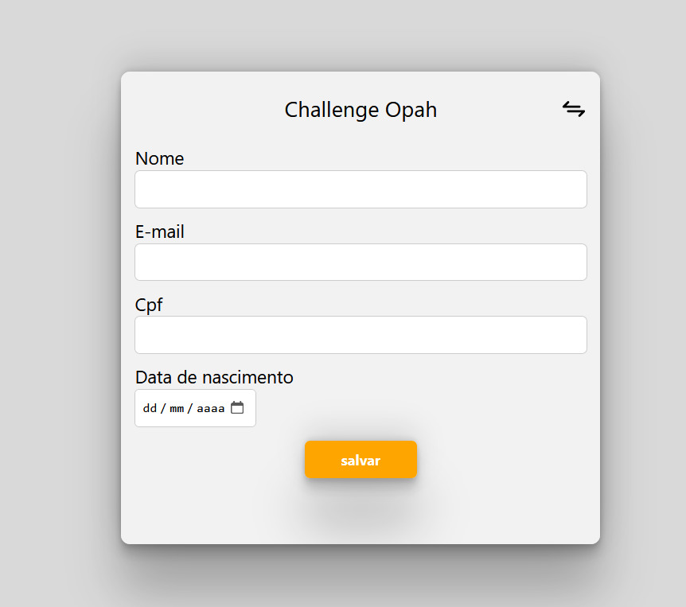
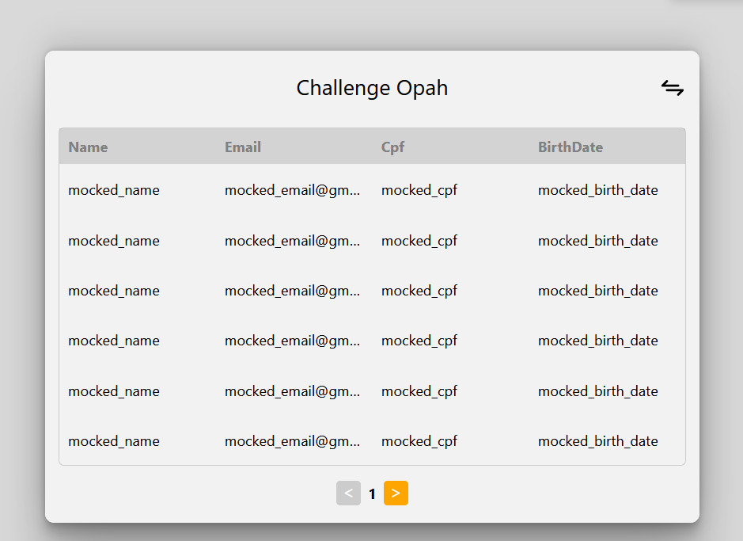

# Challenge Opah

## Descrição

Este projeto é um aplicativo React desenvolvido com o Vite.

## Como Rodar o Projeto

Para rodar este projeto em sua máquina local, siga os passos abaixo:

1. Certifique-se de que você tenha o Node.js instalado. Você pode baixá-lo em [nodejs.org](https://nodejs.org/).

2. Clone este repositório em sua máquina usando o comando:

```bash
 git clone https://github.com/seu-usuario/challenge-opah.git
```

3.  Navegue até a pasta do projeto:

```bash
cd challenge-opah
```

4.  Instale as dependências do projeto:

```bash
yarn
```

5.  Inicie o servidor de desenvolvimento:

```bash
yarn run dev
```

<!-- Imagem à esquerda -->


<!-- Imagem à direita -->

